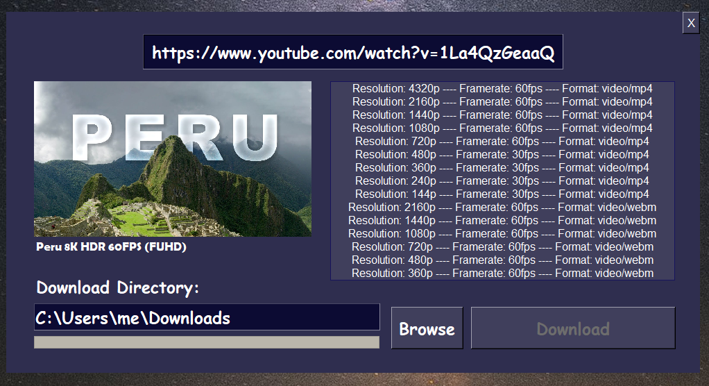

# Open4kDownloader

An open-source video downloader for YouTube that supports all resolutions on the platform. Most applications can only download up to 1080p while including audio. Open4kDownloader will download any resolution and mix the audio back into the stream.

This was intended to be cross platform but have only tested on Windows at the moment.

# Usage 
```cmd
python3 Open4kDownloader.py
```



## Disclaimer

I was fed up with other downloaders and wrote this in about 6 hours. It hasn't been thoroughly tested. These are the current known issues/TODO list.

- Downloading needs to be run in a separate thread to prevent window lag
- Browse button needs to be disabled during downloads
- Audio mixing should be a choice for webm files. There should also be a warning about long processing times
- Need to generate binaries for releases
- Needs some sort of status or console log within the GUI
- Need to implement log files
- Need to save the download directory preference
