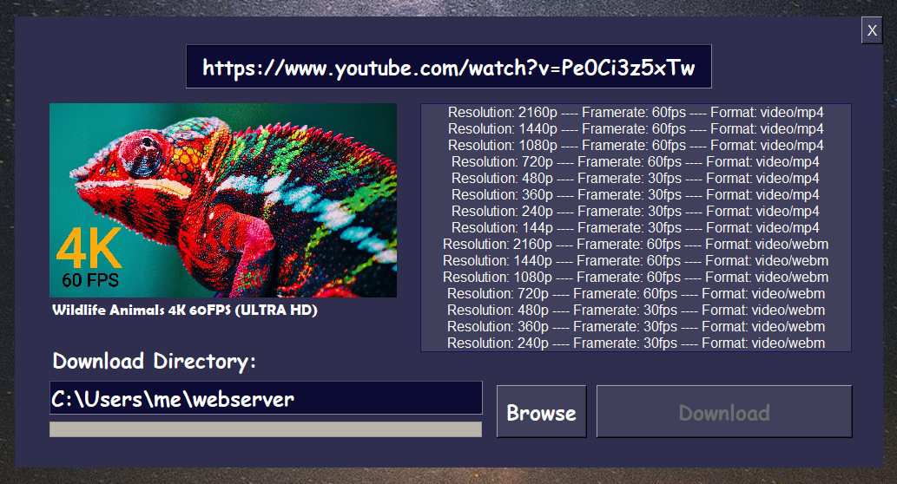

# Open4kDownloader

An open-source video downloader for YouTube that supports all resolutions on the platform. Most applications can only download up to 1080p while including audio. Open4kDownloader will download any resolution and mix the audio back into the stream.

This was intended to be cross platform but have only tested on Windows at the moment.



# Usage 
```cmd
python3 Open4kDownloader.py
```
